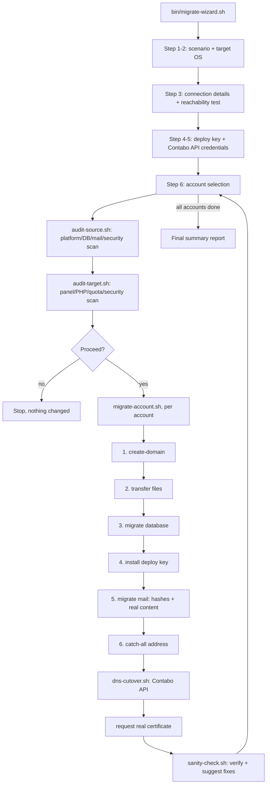

# Architecture

## Design goals

1. **Nothing runs on the source or target server itself.** The wizard runs
   from a third machine (your laptop, a jump box, a CI runner) and drives
   both servers over SSH. Neither server needs anything installed for this
   toolkit to work beyond what a normal cPanel box and a normal Virtualmin
   box already have.
2. **Every phase is independently callable and safe to re-run.** A failed
   migration resumes from the step that failed, not from scratch. File
   transfers, database imports, and mailbox creation all check
   before-state where practical rather than blindly re-doing work.
3. **No destructive action is ever chained after a step that might fail.**
   Cleanup (removing staging directories, deleting placeholder files) is
   always a separate, explicit, final step — never bundled into a script
   whose earlier steps might fail and leave things in a state where an
   unconditional `rm -rf` further down would do real damage.
4. **Everything that can be verified, is.** File counts, row counts,
   message counts, HTTP status codes, and certificate SAN lists are
   checked with real commands against both servers, never assumed from
   "the command didn't print an error."

## Flow

## Why file transfers never go straight server-to-server

Two independent reasons, either one of which is sufficient on its own:

- **It usually doesn't work anyway.** Many rsync builds refuse a
  source-and-destination-both-remote invocation outright
  (`The source and destination cannot both be remote.`), and even where it
  technically works it depends on SSH agent forwarding being configured
  correctly on a machine you may not control.
- **It shouldn't work, on security grounds.** The source and target
  servers should never have standing SSH trust in each other — if either
  one is ever compromised, that trust relationship is exactly the kind of
  thing that turns a single-server incident into a two-server one. Routing
  every transfer through the operator's own machine (`c_relay_copy` /
  `c_relay_tar` in `lib/common.sh`) means neither server needs to know the
  other exists.

## Why the mail migration is two separate phases

A source panel's `/etc/shadow`-style password hash and a mailbox's actual
message content are transferred by completely different mechanisms, and
conflating them is the single most common way this kind of migration goes
wrong silently:

- The **hash** proves a login will work. Copying `virtualmin create-user
  --encpass '<hash>'` from the source's real hash produces a byte-identical
  working password with zero user-visible change — but creates an *empty*
  mailbox.
- The **content** (inbox, sent, trash, custom folders — everything) has to
  be moved as a raw Maildir filesystem transfer, because only a hash (never
  a plaintext password) is ever available to a migration script, which
  rules out IMAP-level synchronization tools like `imapsync`.

A migration that only does the first half looks completely successful
(users can log in!) while silently leaving every user's mail history
behind. This toolkit always does both, and verifies message counts on both
sides rather than trusting "no error" as proof of a complete transfer.

## Extending to other source panels

`lib/audit-source.sh`'s account/domain/mailbox discovery currently assumes
cPanel (`/var/cpanel/users`, `uapi Email list_pops`, `/etc/valiases`). To
support another source panel (Plesk, DirectAdmin, a bare LAMP box), you
only need to reimplement:

- account + real-domain discovery (equivalent of `audit_source_accounts`'s
  domain lookup)
- mailbox discovery (equivalent of `detect_mailboxes`)
- the mailbox password-hash and Maildir *paths* used in
  `phase_migrate_mail` (`lib/migrate-account.sh`)

Everything else — platform detection, database migration, file transfer,
DNS cutover, sanity checks — is already panel-agnostic.
